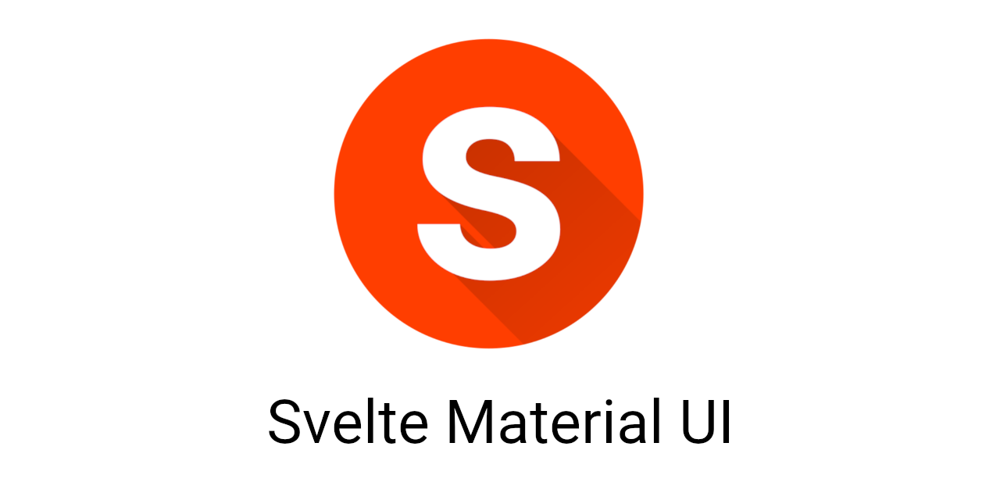

  

A library of Svelte 3 Material UI components, based on the [Material Design Components - Web](https://material.io/develop/web/).

# Demos

https://sveltematerialui.com

# Features

Here are some features you should know about:

- You can add arbitrary attributes to all of the components and many of the elements within them.
- You can add actions to the components with `use={[Action1, [Action2, action2Props], Action3]}`.
- You can add props to lower components and elements with "$" props, like `input$maxlength="15"`.
- **All** events are forwarded. This includes DOM events, MDC events, and custom events.
  - You can add event modifiers with the `on:click$preventDefault$capture={handler}` syntax.
    - If you use Svelte's native `on:click|preventDefault={handler}` syntax, it will not compile. You have to use "$" instead of "|". (The extra S inside the | stands for SMUI.)
  - Supported modifiers are:
    - preventDefault
    - stopPropagation
    - passive
    - nonpassive
    - capture
    - once
- Labels and icons are named exports in the components that use them, or you can use the 'Label' and 'Icon' exports from '@smui/common'. (Except for chips labels and icons, textfield icons, and select icons, because they are special snowflakes.)
- SMUI [supports RTL languages](https://svelte.dev/repl/c2ff2d5dd5404eccb901ba04ef0161be?version=3.37.0).

# Installation

To get started, check out the [installation docs](INSTALL.md).

# Migration

Upgrading from an old version? Be sure to read the [migration doc](MIGRATING.md).

Upgrading from v2? There are **lots** of changes listed in the [upgrade instructions](MIGRATING.md#smui-2---smui-3).

Upgrading from v3? SMUI's styling method has been simplified. Check out the [upgrade instructions](MIGRATING.md#smui-3---smui-4).

# Need Help?

If you need help using SMUI, join the new [Discord server](https://discord.gg/aFzmkrmg9P).

# Components

Click a component/package below to go to the documentation. (Note that this documentation is a work in progress. The demo code should be your main source of truth for how something works.)

- [Banner](packages/banner/README.md)
- [Button](packages/button/README.md)
  - [Floating Action Button](packages/fab/README.md)
  - [Icon Button](packages/icon-button/README.md)
- [Card](packages/card/README.md)
- [Common](packages/common/README.md)
- [Data Table](packages/data-table/README.md)
- [Dialog](packages/dialog/README.md)
- [Drawer](packages/drawer/README.md)
- [Elevation](https://sveltematerialui.com/demo/elevation/)†
- [Image List](packages/image-list/README.md)
- Inputs and Controls
  - [Checkbox](packages/checkbox/README.md)
  - [Chips](packages/chips/README.md)
  - [Floating Label](packages/floating-label/README.md)
  - [Form Field](packages/form-field/README.md)
  - [Line Ripple](packages/line-ripple/README.md)
  - [Notched Outline](packages/notched-outline/README.md)
  - [Radio Button](packages/radio/README.md)
  - [Segmented Button](packages/segmented-button/README.md)
  - [Select Menu](packages/select/README.md)
    - [Select Helper Text](packages/select/helper-text/README.md)
    - [Select Icon](packages/select/icon/README.md)
  - [Slider](packages/slider/README.md)
  - [Switch](packages/switch/README.md)
  - [Text Field](packages/textfield/README.md)
    - [Text Field Character Counter](packages/textfield/character-counter/README.md)
    - [Text Field Helper Text](packages/textfield/helper-text/README.md)
    - [Text Field Icon](packages/textfield/icon/README.md)
- [Layout Grid](packages/layout-grid/README.md)
- [List](packages/list/README.md)
- [Menu Surface](packages/menu-surface/README.md)
- [Menu](packages/menu/README.md)
- [Paper](packages/paper/README.md)‡
- Progress Indicators
  - [Circular Progress](packages/circular-progress/README.md)
  - [Linear Progress](packages/linear-progress/README.md)
- [Ripple](packages/ripple/README.md)
- [Snackbar](packages/snackbar/README.md)
  - [Kitchen](packages/snackbar/kitchen/README.md)‡
- Tabs
  - [Tab](packages/tab/README.md)
  - [Tab Bar](packages/tab-bar/README.md)
- [Tooltip](packages/tooltip/README.md)
- [Top App Bar](packages/top-app-bar/README.md)
- [Touch Target](packages/touch-target/README.md)
- [Typography](https://sveltematerialui.com/demo/typography/)†

† This is Sass based, and therefore doesn't require Svelte components. I've included a demo showing how you can use it.

‡ This is not an MDC Web component. It is an addition that SMUI provides.

# Support

You can support my work on this project through my other project, [Tunnelgram](https://tunnelgram.com). I have a [Patreon](https://www.patreon.com/tunnelgram) set up for it. I started this project in order to Materialize Tunnelgram.

# License

Copyright 2020-2021 Hunter Perrin

Licensed under the Apache License, Version 2.0 (the "License");
you may not use this file except in compliance with the License.
You may obtain a copy of the License at

    http://www.apache.org/licenses/LICENSE-2.0

Unless required by applicable law or agreed to in writing, software
distributed under the License is distributed on an "AS IS" BASIS,
WITHOUT WARRANTIES OR CONDITIONS OF ANY KIND, either express or implied.
See the License for the specific language governing permissions and
limitations under the License.
